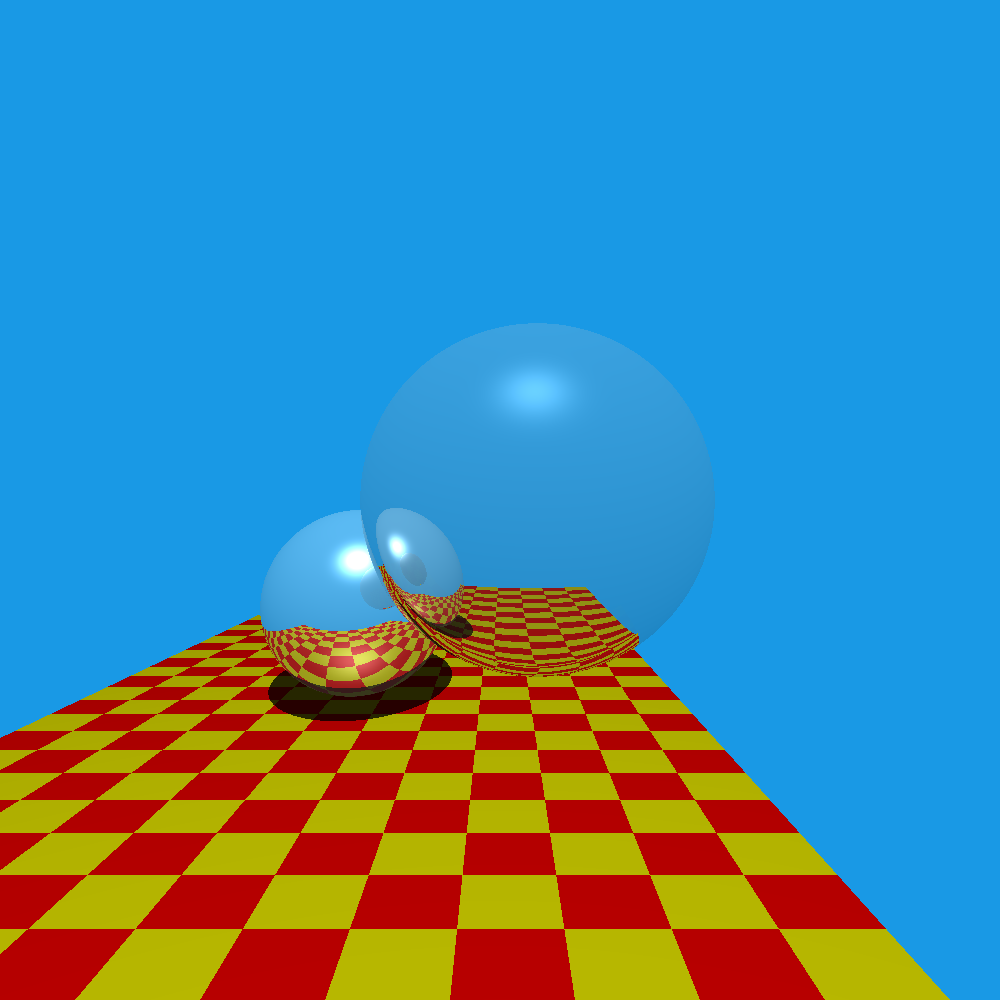

# GPU-Raytracer
This is a GPU based Raytracer using C++/GLSL. ALL object defining and ray tracing take place in shaders. To render basic objects, use color shader. To render ocean simulation, use water shader. No additional libraries needed.

## Raytracer

Ray-tracing is done in the vertex and fragment shaders: GI.vs and GI.fs. The majority of the tracing is done in the fragment shader and the vertex shader is only passing the value of screen coordinates to fragment shader. 

## Tone Reproduction

Tone Reproduction is done in the main.cpp in the src folder in function tone_reproduction() and tone_reproduction_Advanced(). Uncomment line 376 and 377 to enable both tone reproduction functions. Make sure to close the picture window before closing the console because tone reproduction only runs after picture window is closed.

## Ocean Simulation

Watch the demo video: https://drive.google.com/file/d/1L65ZH91Dx2d1JTCu2CHZgv1UXK4tcnPv/view?resourcekey
Using the water shader, the ocean simulation is played in real time, featured with caustics effect. By clicking on the ocean, ripples can be observe. We also implemented the rotation of the sun and moon, which affects the environment lighting.

Workload Distribution:
Noya: 
Gerstner wave function
Circle wave function
Sun & moon rotation
Perlin noise for sand
Correct shadow under transparent surface

Tsingtao: 
Read Noya’s code
Caustic Effect
Click interaction
Circle wave function
Ripple spread & fade out
Failed attempt on ray tracing a ton triangles in each shader

